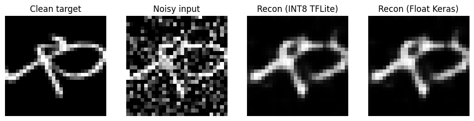
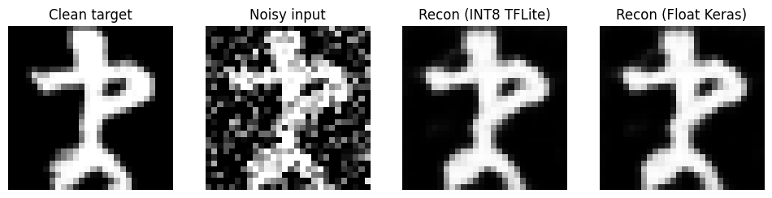

# Keras KMNIST Denoising Autoencoder (TensorFlow / Keras)

This repository is a cleaned version of my *Vertiefungsprojekt* notebook.

It demonstrates a **reproducible Python ML pipeline** for **image denoising** using a small **CNN autoencoder** on the public **KMNIST** dataset.

## What this version of the project does

- Loads **KMNIST** via `tensorflow_datasets`
- Creates *(noisy input, clean target)* pairs using **deterministic stateless Gaussian noise**
- Trains a compact **convolutional autoencoder** (Conv2D + Conv2DTranspose)
- Converts the trained model to **fully INT8 quantized TFLite** using a representative dataset
- Runs a **desktop sanity-check** with a TFLite interpreter and visualizes reconstructions

## Model Architecture

The model follows a standard encoder–decoder structure:

- Convolutional encoder (Conv2D layers with downsampling)
- Latent bottleneck representation
- Transposed convolutional decoder (Conv2DTranspose layers)

The architecture is intentionally compact (~4.8k parameters) to keep the pipeline lightweight and suitable for later deployment experiments.

## Training Setup

- Optimizer: **Adam**
- Loss function: **Mean Squared Error (MSE)**
- Epochs: **5**
- Input size: **28×28 grayscale**
- Gaussian noise standard deviation: **0.35**

Randomness is controlled using stateless TensorFlow operations so that each dataset index always receives the same noise pattern.

## Evaluation

Model quality is evaluated using:

- Reconstruction **MSE**
- Visual comparison between:
  - clean input
  - noisy input
  - float Keras reconstruction
  - INT8 TFLite reconstruction

The INT8 model is additionally checked via TFLite operator inspection to confirm full integer quantization.

## Example Reconstruction

Below is a qualitative comparison between clean input, noisy input,
float reconstruction, and INT8 TFLite reconstruction.



## Quick start

Create a virtual environment and install dependencies:

```bash
pip install -r requirements.txt
```

### Train (float Keras)

```bash
python -m src.train
```

### Convert to INT8 TFLite + print operator list

```bash
python -m src.quantize_int8
```

### Run INT8 TFLite sanity check + plots

```bash
python -m src.evaluate_tflite_int8
```

## Notes

- Default training is **5 epochs** (kept intentionally short).
- The noise generation is **deterministic**: each sample index always receives the same noise pattern.
- The code is split from the original Colab notebook into small files for readability.
